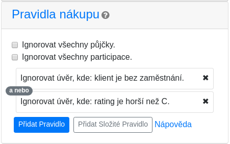
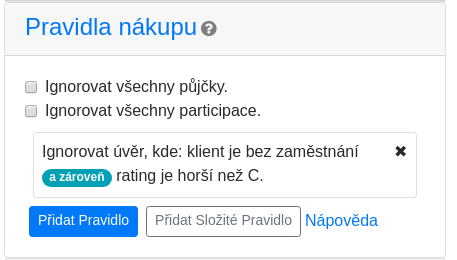
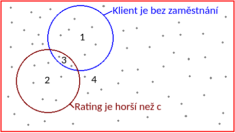

# Pravidla nákupu a prodeje

Tato stránka vysvětluje jak správně nastavit pravidla nákupu a prodeje ve [webovém konfigurátoru](https://robozonky.github.io/konfigurace-strategie/) RoboZonky.

## Základní pojmy

-   _Primární tržiště_ - je místo, kde lidé žádají o _půjčky_. Pokud se jako investor rozhodnete žadateli část peněz půjčit, získáte na půjčce _participaci_.
-   _Sekundární tržiště_ - je místo, kde investoři mohou prodávat své participace jiným investorům, případně je od jiných investorů kupovat. Pro více informací si přečtěte ["Co je sekundární trh a k čemu slouží?"](https://zonky.cz/otazky-a-odpovedi-investor#odpoved24) na zonky.cz

## Pravidla nákupu

Pravidla nákupu říkají robotovi do jakých půjček a participací má investovat.
Ve výchozím nastavení robot investuje do všech půjček i participací (s přihlédnutím k Vašemu nastavení struktury portfolia).
Výchozí nastavení můžete změnit dvěma způsoby:

1.  Vytvořením pravidel určujících které položky na tržišti si přejete ignorovat.
2.  Nákup úplně zakázat zaškrtnutím jednoho nebo obou políček `Ignorovat všechny půjčky` / `Ignorovat všechny participace`. Zaškrtnutím těchto políček znemožníte vytváření odpovídajících pravidel. Například zaškrtnutí `Ignorovat všechny půjčky` způsobí, že nástroj Vám neumožní vytvářet pravidla pro nákup půjček.

## Pravidla prodeje

Ve výchozím nastavení robot nic neprodává.
Toto nastavení můžete změnit tak, že vytvoříte pravidla určující které participace si přejete prodávat.
V případě, že si přejete prodat _všechny_ participace, použijte nastavení `Opuštění Zonky` v sekci `Obecná nastavení`.

## Jednoduchá a složitá pravidla: vyvarujte se častých chyb

Nesprávná konfigurace pravidel nákupu a prodeje je jednou z častých chyb, které se uživatelé dopouštějí.
Taková chyba může vést k tomu, že robot bude investovat do půjček, do kterých jste investovat nechtěli nebo naopak nebude investovat vůbec.

Vysvětleme si vše na příkladu. Srovnejte následující dvě nastavení pravidel nákupu a zkuste se zamyslet, jak se bude robot s takovým nastavením chovat.

|            Nastavení 1: Dvě pravidla, každé má jednu podmínku           |       Nastavení 2: Jedno (složité) pravidlo se dvěma podmínkami      |
| :---------------------------------------------------------------------: | :------------------------------------------------------------------: |
|  |  |

Rozdíl mezi nimi si objasněme s pomocí obrázku:

Červený obdélník obsahuje všechny půjčky a participace (znázorněné šedými tečkami) na tržišti.
Dvě podmínky použité ve výše zmíněných pravidlech logicky rozdělují všechny půjčky a participace do čtyřech kategorií (znázorněné čísly 1-4):

1.  ty, kde klient je bez zaměstnání _a zároveň_ rating je C nebo lepší
2.  ty, kde klient _není_ bez zaměstnání _a zároveň_ rating je horší než C
3.  ty, kde klient je bez zaměstnání _a zároveň_ rating je horší než C
4.  ty, kde klient není bez zaměstnání _a zároveň_ rating je C nebo lepší

Nastavení 1 způsobí, že robot bude ignorovat všechno co se nachází v kategoriích 1, 2 nebo 3.

Nastavení 2 způsobí, že robot bude ignorovat pouze položky v kategorii 3. Zejména tedy bude investovat do položek kde klient je bez zaměstnání (ale jeho rating je C nebo lepší) a dále do položek s ratingem horším než C (ale kde klient není nezaměstnaný).

Ani jedno z nastavení není nezbytně špatně. Hlavní rozdíl mezi nimi je, že v případě druhého nastavení **bude robot ignorovat jen velmi malou část půjček na tržišti**, protože půjček, které splňují obě podmínky _zároveň_ je daleko méně než půjček, které splňují alespoň jednu z nich.

## Jednoduchá pravidla

Jednoduchá pravidla umožňují definovat jedinou podmínku, kterou musí půjčka či participace splňovat, aby ji robot zainvestoval.
Pro tvorbu většiny strategií si vystačíte s jednoduchými pravidly.

## Složitá pravidla

:warning: **Tvorbě složitých pravidel Vám doporučujeme se vyvarovat, pokud si nejste dostatečně jistí svými znalostmi výrokové logiky.
Máte-li dojem, že robot investuje do jiných půjček než jste zamýšleli, případně neinvestuje vůbec, může to být právě chybným použitím složitých pravidel.**

Narozdíl od jednoduchých pravidel umožňují složitá pravidla specifikovat:

-   více podmínek. Robot bude ignorovat půjčky, které splní _všechny_ podmínky pravidla
-   výjímky, které "přebijí" podmínky pravidel a způsobí, že robot bude investovat do půjček splňující _všechny_ podmínky výjimky, přesto že zároveň nesplňují _všechny_ podmínky pravidla. Výjimky pravidla můžete (ale nemusíte) nastavit po kliknutí na tlačítko `Přidat Výjimku`.
